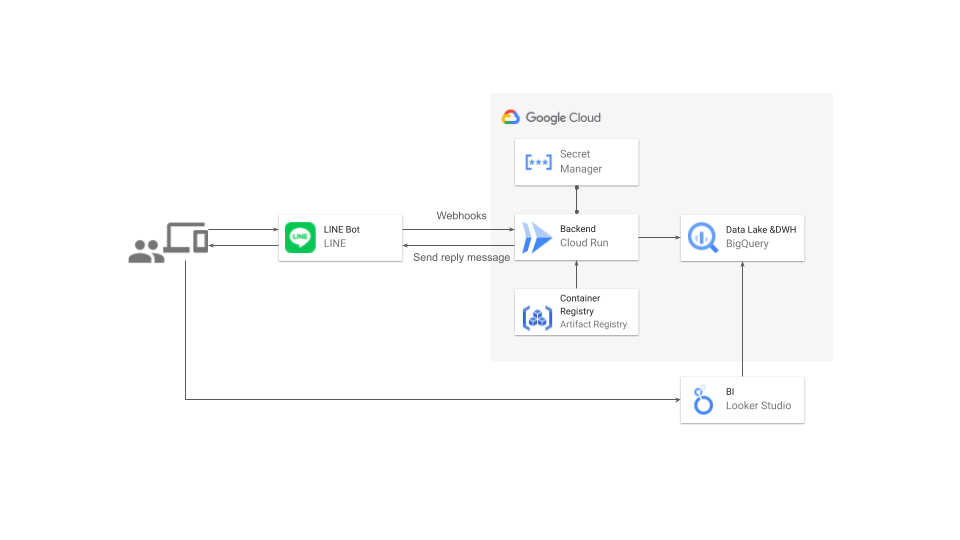

# linebot-googlecloud-sample



## Getting Started

- prepare

```console
cd backend
yarn install
```

- ngrok のインストール

```console
brew install ngrok
```

- ngrok でのアカウント登録(`https://dashboard.ngrok.com/signup`)
- dashboad にてトークンを入手し、認証する

```console
ngrok config add-authtoken <your auth token>
```

- .env ファイルの作成

```console
cd backend
cp -pr .env.sample .env
```

- .env には以下を記載する

| 変数名                    | 値                                                                                                       |
| ------------------------- | -------------------------------------------------------------------------------------------------------- |
| LINE_CHANNEL_ACCESS_TOKEN | LINE Developers コンソールの `Messaging APIチャネル` > `Messaging API 設定` > `チャネルアクセストークン` |
| LINE_CHANNEL_SECRET       | LINE Developers コンソールの `Messaging APIチャネル` > `チャネル基本設定` > `チャネルシークレット`       |
| PORT                      | 3000(別になんでも良い)                                                                                   |

- local server 起動

```console
yarn dev
```

- ngrok で local の 3000 番ポートを公開

```console
ngrok http 3000
```

- 表示された`Forwarding`の`https://`から始まる URL の末尾に`/webhook`を付与したものを、`Messaging APIチャネル` > `Messaging API 設定` > `Webhook URL`に設定。(その他 Webhook の利用を ON)

- QR コードを LINE アプリで読み込み、友だち追加したあと、なにか発話すると返答してくる。

## Deploy(WIP:現状ソースコードからのデプロイはできていない。)

- gcloud login

```console
gcloud init # 初回のみ
gcloud auth login
gcloud projects list
gcloud config set project linedc-handson
gcloud auth application-default login
```

- deploy

```console
cd backend
gcloud run deploy linebot-dev \
  --region asia-northeast1 \
  --port=3000 \
  --set-env-vars=LINE_CHANNEL_ACCESS_TOKEN=your access token \
  --set-env-vars=LINE_CHANNEL_SECRET=your secret \
  --set-env-vars=LISTEN_PORT=3000 \
  --no-allow-unauthenticated \
  --source .
```
